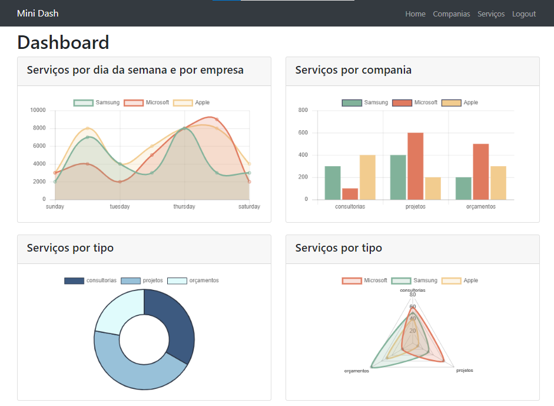

# Mini dashboard (Django MVT)

## How to use

```bash
git clone
cd minidashboard
python3 -m venv myvenv
. myvenv/Scripts/activate
pip install -r requirements.txt
python manage.py makemigrations companies
python manage.py makemigrations personalservices
python manage.py migrate
python createsuperuser
python manage.py loaddata companies.json
python generate-personalservices-data.py
python manage.py loaddata personalservices.json
python manage.py runserver
```

- Enter with _http://localhost:8000_ in webbrowser
- Login with superuser.

## To do

- Feed template charts with database info.

## Charts

<h1 align="center">
  
</h1>

## References

- https://books.agiliq.com/projects/django-orm-cookbook/en/latest/index.html
